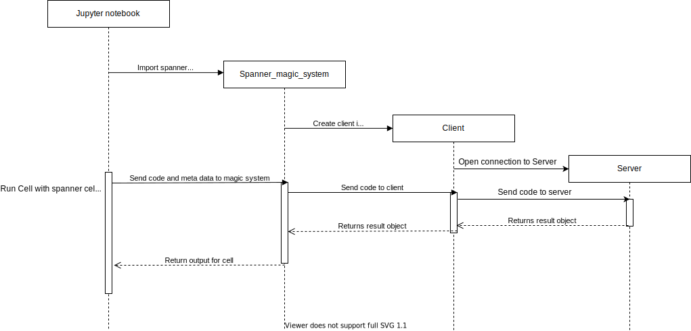
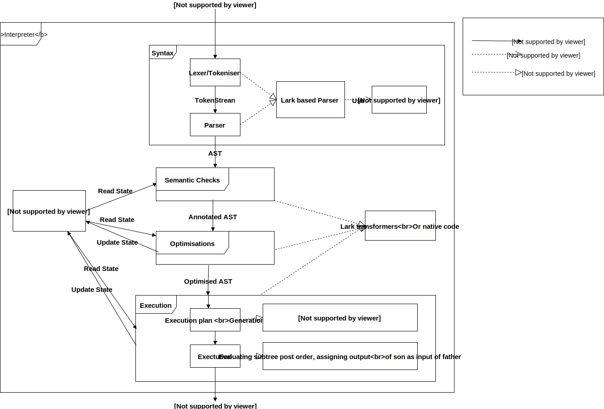

# Spanner Workbench
<!-- @import "[TOC]" {cmd="toc" depthFrom=1 depthTo=6 orderedList=false} -->

<!-- code_chunk_output -->

- [Spanner Workbench](#spanner-workbench)
  - [external resources](#external-resources)
    - [Sources of inspiration](#sources-of-inspiration)
    - [resources about building interpreters:](#resources-about-building-interpreters)
    - [relevant papers](#relevant-papers)
  - [The REPL of the interpreter](#the-repl-of-the-interpreter)
  - [build of the interpreter](#build-of-the-interpreter)
      - [Lexer and Parser](#lexer-and-parser)
    - [The mirco-passes in general](#the-mirco-passes-in-general)
      - [design considerations](#design-considerations)
      - [implementation](#implementation)
    - [required passes](#required-passes)
  - [The Engine](#the-engine)
    - [Datalog evalutation pass](#datalog-evalutation-pass)
    - [regex evaluation](#regex-evaluation)
    - [garbage collection](#garbage-collection)

<!-- /code_chunk_output -->

The spanner workbench is an interpreter and a REPL system for spanner-like languages.
Our goal in developing the spanner workbench are two fold
* First and foremost, to allow students learning about spanner languages an easy to use system to play around with the languages.
* A later goal is to provide a easily modifiable framework that allows researchers to easily test and deploy new algorithms and optimizations to spanner languages.

## external resources
### Sources of inspiration

[Logicblox repl](https://developer.logicblox.com/content/docs4/tutorial/repl/section/split.html)
[Logicblox manual](https://developer.logicblox.com/content/docs4/core-reference/html/index.html)

LogiQL is the language implemented in logicblox and is a Dialect of [Datalog](https://en.wikipedia.org/wiki/Datalog) 

Datalog in turn is derived by [Prolog](https://en.wikipedia.org/wiki/Prolog)

Here is a [python implementation of a Datalog library](https://github.com/pcarbonn/pyDatalog
)

### resources about building interpreters:

[A 5 minute look at building your own language](https://www.freecodecamp.org/news/the-programming-language-pipeline-91d3f449c919/)

[Introduction to grammars and Automatas](https://www.tutorialspoint.com/automata_theory/introduction_to_grammars.htm)

[Compiler design tutorials](https://www.geeksforgeeks.org/compiler-design-tutorials/)

### relevant papers

* [spannerlog](papers/spanner_log_Y_nachshon.pdf)
* [Recursive RGXLog](papers/Recures_programs_for_document_spanners.pdf)

## The REPL of the interpreter
Programming wise, the question of how to implement an interpreter is orthogonal to how to 
implement a Read Evaluate Print Loop (REPL) interface for the interpreter.
You can think of it like the frontend and the backend of the app.

The way we decided to implement the front end of the workbench if to use jupyter notebook's magic system. As seen bellow, it is a system that allows you to delegate running a piece of code to an external module. Specifically for our case, we can delegate 
running code that is written in our own syntax (RGXLog at the moment) to an instance of our interpreter.

Here is an example of langugage magic in bash.

Here is schematic view of the interaction

Here is a list of resources and examples for building magic systems:
* [intro to magic usage](https://blog.dominodatalab.com/lesser-known-ways-of-using-notebooks/)
* [Guide to deifne your own magic system](https://ipython.readthedocs.io/en/stable/config/custommagics.html)
* [Implementation of R magic system](https://bitbucket.org/rpy2/rpy2/src/default/rpy2/ipython/rmagic.py)
  * Note that this is overkill for us, its just so you can see how a mature cross language magic system can be implemented.

## build of the interpreter

[Link to 0.1 language specification](doc/language_spec.pdf)

Here is a general schematic explanation of how our interpreter looks like. Bellow We go over the different components and implementation considerations.

Interpreters come in two flavours:
* Monolythic (Single Pass)
* Micropass (Multi Pass)

Both generate the AST from the string containing the source code and then have the source code go through an entire interpreting process similar to what is 
shown above. While the former flavour does so in one giant pass, performing each step as soon as it can, the latter flavor defines many 
sequential passes on the entire AST, each one doing a very small task.

We chose the micropass approach for this project as it is more modular and easier to understand for new developers. Moreover, by exposing the pass-stack in an accessible way to researchers, we can allow new algorithms/optimizations to be added to our platform with minimal effort. A researcher that wants to add his own improvement to our platform, can potentially write only a single pass and add it in the appropriate place in the pass-stack, easily leveraging the already written passes.

Both different passes of the same command, and passes from different commands will need to save or look at the state of the entire session. We will refer to this state object as the engine and will talk about its make up down bellow.

#### Lexer and Parser
The lexer and parser are used to convert the string containing the source code in the AST that defines the logical structure of the code. Lexers and parsers are often written together and come in two general flavors:

* Parser/Lexer as code
* Parser/Lexer as definition files

The former refers to writting code that parses/lexes our code directly. The problem with such parsers are that the grammar and syntax of those parsers is implicitly written within the code, with an external document explaining the syntax in general strokes. This makes changing/debugging the parser complicated, and also risks loss of knowledge as the parser and the external documentation drift further away as time goes on.

The latter approach is to have the documentation generate the code programmatically. Inthis case we will have a file that defines the grammar percisly in a declerative manner, and this file will be fed to a grammer-to-parser algorithm that will generate the parser automatically.

We chose the latter approach and will be using the [lark](https://lark-parser.readthedocs.io/en/latest/) python package to generate our parsers.

### The mirco-passes in general
#### design considerations
Given that the micro-pass archetecture will allow us modular and incremental improvement of our intereter, in our 0.1 release we want only essentail passes that our language cant function without and we want these passes to be implemented in as a naive way as possible while retaining two important constraints:

* Passes that should logically be kept seperate should not be artificially merged even if that results in less code (or in code that is slightly easier to write).
* When using black box implementations for execution, we should delegate only the most lower level constracts to the black boxes, and not task them with structural decomposition.

Let me give examples of these two constraints.
For the first constraint: Lets say that checking that IE functions are defined and cehcking that referenced variables are defined is very similar. It could be the case that one could check both in one pass together with less code by checking a common identifier pool. However, these should be written as different passes, even if their code ends up being similar.

For the second constrainst: Since we are going to use outside datalog implementation for our execution in 0.1 it is possible to send every subtree in our AST which is in pure datalog to the external implementation. However, that would hide too much behind the external implementation and would mean that future optimisations would have the initial cost of decomposing the dependency of our porgram on the external datalog engine. This initial cost is too high and doesnt scale well architecturally. Instead, we should decompose datalog queries into their smallest constituents and implement the basic datalog operations by wrapping their counterparts in the external datalog engine.

#### implementation
Passes and their implementors differ in how involved they need or want to be in the overall structure of the tree and in how they want to address the tradeoff between independence and relliance on tools we provide for them.
One pass implementor might just want to add some data to certain nodes tha can be derived from the nodes locally. 
Another pass implementor has specific low level C code that he wants to run on his own tree like data structure.

In addition to generating our Lexer and Parser, lark provides some utilities such as [iterators, visitors and transformers](https://lark-parser.readthedocs.io/en/latest/classes/)
We can use and expose them to implementers to make writting passes easier.
However, since not all implementors will want to use those or use python at all we should make 3 (and make accessible) different ways of implementing passes.
* Using visitors/transformers
* Getting the AST tree itself and writting general python code on top of it
* Getting a serialised version of the AST and other information and sending it to someother function(For example some C code)

The first two we get for free with lark. For the last one, we need to make sure that our ASTs and the state of our engine are easily serialisable into a standard serilisation protocol (such as JSON). And that we have utility functions that do the serialisation and unserialisation.

### required passes 
I will the passes that we have to implement to have a functioning RGXLog interpreter.

Semantic passes
* existance and correct arity of IE function.
* existance of referenced variable
* existance of refernced relations
* Safty of datalog rules
* existance and access to external documents

Execution passes
* RGX extractions to relations
* Datalog evaluation
* Grabage collection 

In the 0.1 version the execution passes can be done by simple postorder walks on the AST.
In future versions, we will need to define and implement a queue mechanism coupled with an abstract evaluation mechanim.

I consider the semantic passes defined here as self explanatory. Bellow I define a naive implmentation for the engine upon which I can discuss how to build the naive execution passes.

## The Engine
Without going into an involved derivation of the structure of this engine, i can say that we need the following constructs in out engine.

* A memory heap
  * Contains pointers to all allocated data
  * This can be a python dictionary with a `new_unused_key` generator
* A Term forest
  * This will contain all terms that exist in our engine and their dependecies on other terms. For example, the head of a conjunctive querry needs to have the relations under conjunction as his children in the forest.
  * Since we allow recursive querries this wont realy be a forest, but it still will have several roots.
  * This tree will need to save the evluation state of each node (ie {computed,notcomputed,dirty})
  * We can work with a networkX tree for now.
* A variable table
  * A mapping between variables and the nodes they point to in the term forest
  * can be a python dict for now

### Datalog evalutation pass

To implement this we can defer to [pyDatalog](https://github.com/pcarbonn/pyDatalog).
* We can just keep an instance of pyDatalog session and call it to compute results.
* We need to find a relational representation that pyDatalog can parse, maybe some SQLalcehmy data structure. We will find one that can export inself to alot of standard formats and create the IE extractions using that datastructure. Once we have stabilised we can decide which interface our reltaional representation needs to take and use the abstract interface to enable polymorphism.
  

### regex evaluation
* We can just use [python.re](https://docs.python.org/3/library/re.html) for now.
* We can wrap it with a conversion between its native syntax and our changes (for example the `(?<name>expression)` syntax from the 0.1 language specification doc)
* We can extract the results into the relational representation we discussed in the datalog evaluation pass.

### garbage collection
Lets start with something really simple
* At the end of each interpretation iteration, see which items in the memoery heap are not reachable from the set of nodes pointed to by the variables in the term tree.
* If a node has not been reachable for over `k` commands, delete it from the memory heap